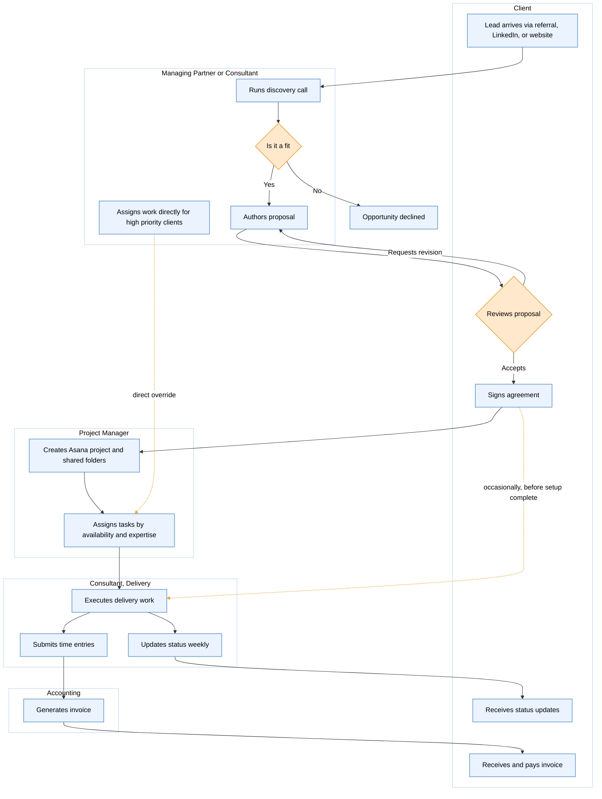

# Task 1: Process Discovery Analysis

# Process Summary: Client Engagement & Delivery Lifecycle

Prepared following discovery with Michael Reynolds, Managing Partner

## Purpose of the Process

The process governs how the firm converts a prospective client into delivered, billed work, spanning lead intake, proposal, contracting, delivery, client communication, and invoicing. Its intended purpose is to acquire, deliver, and monetize consulting engagements in a repeatable way.

In its current state, that repeatability is only partially realized. The process runs on individual judgment rather than documented rules. The stakeholder's own diagnosis, offered without prompting, was a single word: consistency. His stated goal of a more standardized delivery process from sales through project completion confirms that the objective of this engagement is end to end standardization, not an isolated fix to any one stage.

## Key Stakeholders

| Stakeholder | Role in the Process |
|---|---|
| Managing Partner | Runs some discovery calls, authors most proposals, assigns work directly for high-priority clients, and serves as the de facto owner of the overall process |
| Consultants and Senior Consultants | Run discovery calls, sometimes author their own proposals, execute delivery, and are expected to update task status weekly |
| Project Manager | Creates the Asana project and shared folders after signing, and assigns tasks based on consultant availability and expertise |
| Accounting | Generates invoices on schedule for fixed-fee work, and from submitted time entries for hourly work |
| Client | Provides requirements, approves or requests revisions to proposals, signs agreements, chooses preferred communication format, and receives and pays invoices |

Accountability is split at nearly every stage. Discovery calls, proposal authorship, and task assignment are each owned by more than one role depending on circumstance, with no documented rule governing which role applies when.

## Systems and Tools Referenced

| System or Tool | Purpose |
|---|---|
| HubSpot | CRM and lead logging; used inconsistently and frequently skipped for fast-moving referrals |
| Asana | Primary project and task tracker; adoption is high but not universal, and update discipline varies by consultant |
| Google Drive | One of several parallel locations where project documentation ends up |
| Slack and Email | Informal substitutes for status updates and communication |
| Spreadsheet | Manual capacity tracking in place of a formal resource-planning system, which the stakeholder confirmed does not exist |
| Invoicing system and time-tracking mechanism | Referenced by function but not named; to be confirmed in follow-up |

No tool currently in use is inadequate for its purpose. The gap is adoption discipline and the absence of a single enforced system of record, not tooling capability.

## Major Process Stages

**1. Lead Intake and Qualification**
Lead arrives (referral, LinkedIn, or website) → discovery call (owner varies by circumstance) → optional CRM logging → fit assessment.
This stage establishes whether an inbound inquiry becomes a pursued opportunity. The absence of a fixed owner for the discovery call, and the optional nature of CRM logging, mean the firm's earliest and most important data capture point is also its least reliable.

**2. Proposal and Contracting**
Proposal authored (Partner or senior consultant, loosely standardized format) → sent to client → revision cycle if requested → agreement signed.
This stage converts a qualified opportunity into a committed engagement. Authorship defaults to the Partner, which concentrates the firm's sales output through a single person, and the revision cycle has no defined limit or version control, making it an open-ended loop rather than a managed step.

**3. Engagement Setup and Onboarding**
Kickoff scheduled → Project Manager creates Asana project and shared folders.
This stage is intended to establish the operational record for the engagement before delivery begins. In practice, delivery sometimes starts before this setup is complete when clients want to move quickly. This is the single highest-impact deviation in the process, as it is the origin point for downstream documentation and billing gaps.

**4. Delivery and Client Management**
Tasks assigned (Project Manager by default, Partner for high-priority clients) → work executed → weekly status updates (fragmented across Asana, Slack, and email) → client reporting (meeting, written report, or call).
This stage carries out the engagement and keeps the client informed. Status tracking is split across three separate tools depending on the individual consultant, and the client communication format is chosen ad hoc, with no consistent link to engagement size or cost to serve.

**5. Billing and Revenue**
Fixed-fee engagements invoiced monthly on schedule → hourly engagements invoiced from consultant-submitted time entries.
This stage converts delivered work into recognized revenue. Fixed-fee billing runs reliably on a calendar trigger, while hourly billing depends on timely time-entry submission, which the stakeholder confirmed sometimes arrives late, directly delaying cash flow.

## Inputs and Outputs

| Stage | Key Inputs | Key Outputs |
|---|---|---|
| Lead Intake and Qualification | Inbound inquiry, client need | Qualified opportunity, discovery notes |
| Proposal and Contracting | Discovery findings, client requirements | Proposal, signed agreement |
| Setup and Onboarding | Signed agreement | Asana project, shared folders, scheduled kickoff |
| Delivery and Client Management | Consultant availability and expertise, project scope | Completed deliverables, status updates, client reports |
| Billing and Revenue | Time entries, fee terms, milestones | Invoices, recognized revenue |

End to end, the process converts an inbound lead with a business need into delivered client value and captured revenue. Each handoff between stages, however, depends on a discretionary individual action rather than a system-enforced trigger.

## Important Decision Points

### 1. Ownership of the Discovery Call

The initial discovery call is conducted by either the Managing Partner or any consultant, with no fixed assignment rule governing which. As the first point of contact in the entire lifecycle, this lack of a designated owner sets a precedent of shared, undefined accountability that recurs throughout the process.

### 2. Whether to Log the Lead in the CRM

Logging a new lead in HubSpot is treated as optional and is frequently skipped when a referral is moving quickly. As a result, the firm captures the least reliable data about its warmest and highest-value leads, limiting its ability to measure conversion and channel performance.

### 3. Qualification of Fit

Whether a prospective engagement is a good fit is assessed subjectively during or after the discovery call, with no documented criteria. This makes qualification dependent on the judgment and experience of whoever ran the call, rather than a consistent standard applied across the firm.

### 4. Authorship of the Proposal

Proposals are authored by the Managing Partner by default, with senior consultants preparing their own by exception. This concentrates the firm's most important sales artifact through a single person in most cases, creating both a bottleneck and a source of formatting inconsistency across engagements.

### 5. Client Response to the Proposal

Once sent, a proposal may be accepted, returned for revisions, or declined. The revision path in particular operates as an open loop, with no defined limit on rounds or version control, meaning it can consume significant unstructured time before resolution.

### 6. Beginning Delivery Before Setup Is Complete

Delivery work sometimes begins before the Project Manager has finished creating the Asana project and shared folders, typically when a client wants to move quickly. This is the single highest-impact decision point in the process, as it is the origin point for the documentation gaps and billing delays that surface later in the engagement.

### 7. Assignment of Delivery Work

Tasks are assigned by the Project Manager by default, based on consultant availability and expertise, but the Managing Partner assigns work directly for high-priority clients. With no shared visibility between these two decision-makers and no formal resource-planning system beyond a spreadsheet, this creates a real risk of double-booking as volume grows.

### 8. Client Communication Format

Clients are updated through a status meeting, a written report, or a quick call, chosen ad hoc for each engagement. There is no consistent link between the format selected and the engagement's size or fee, meaning delivery effort and revenue are not reliably matched.

### 9. Billing Trigger and Timing

Fixed-fee engagements are billed on a monthly schedule, while hourly engagements depend on consultants submitting time entries. Time entries are confirmed to sometimes arrive late, directly delaying invoicing and revenue recognition, making this the decision point with the most immediate financial consequence.

### Summary Observation

Seven of these nine decisions are currently resolved by individual judgment in the moment rather than by a documented rule. The two elements of the process that do run reliably, the signed agreement as a hard gate and the Project Manager's setup routine, share the same design feature the other seven lack: a single named owner and a clearly defined trigger. That distinction is the structural basis for the standardization the stakeholder has requested.

---

# Information Gap Analysis

The RAID framework, covering Risks, Assumptions, Issues, and Dependencies, is used to organize the gaps surfaced during discovery. Each category represents a specific part of this task.

Issues represent both missing information and unclear responsibilities. These are confirmed, present-state facts about the process as it exists today, either a piece of information that is absent or a step in the process with no clearly assigned owner.

Assumptions represent the assumptions that cannot yet be validated. These are beliefs the analysis is currently relying on that were stated or implied during the discovery call but never directly confirmed.

Dependencies represent the areas requiring additional discovery. These are the specific pieces of information, data, or follow-up conversations that subsequent analysis and recommendations cannot proceed without.

Risks are included as a distinct category to translate the Issues and Assumptions above into their potential business consequences, showing why each gap matters rather than simply noting that it exists.

Each entry below is sourced to a specific point in the discovery transcript rather than stated generically.

## Risks

What could go wrong if the current gaps are left unaddressed.

| ID | Risk | Source in Transcript | Potential Impact |
|---|---|---|---|
| R1 | Undocumented delivery work (started before Asana/folder setup) is never reconciled into the project record | "Occasionally consultants start work before everything is fully set up" | Lost billable hours, disputes over scope delivered, no audit trail if a client challenges an invoice |
| R2 | Late or missing time entries cause not just delayed billing but permanently unbilled hours | "Sometimes time entries come in late, which delays billing" | Direct, quantifiable revenue leakage, not just a cash-flow timing issue |
| R3 | The capacity spreadsheet is acted on as if authoritative while being silently incomplete after Partner overrides | "Sometimes I assign work directly if it's a high-priority client... we mostly track capacity in a spreadsheet" | Double-booking, consultant burnout, missed deadlines on concurrent engagements |
| R4 | Inconsistent proposal authorship leads to inconsistent pricing or scoping logic, not just inconsistent formatting | "Everyone has their own approach" | Margin erosion or client perception of unfair/inconsistent pricing across similar engagements |
| R5 | A standardized process is designed but has no enforcement owner, so it decays back to the current informal state | "I'd want a more standardized delivery process" (no owner named) | Wasted consulting investment; recurrence of the exact problem this engagement is meant to solve |

## Assumptions

What is currently being treated as true without validation.

| ID | Assumption | Source in Transcript | Why It Cannot Yet Be Validated |
|---|---|---|---|
| A1 | "Moving quickly" is the only condition under which CRM logging is skipped | "Sometimes we don't if it's a referral and we're moving quickly" | Only one example was volunteered; other causes (habit, training gaps) were never tested |
| A2 | Frequent proposal revisions are a normal negotiation pattern, not a symptom of miscalibrated first drafts | "Sometimes clients want revisions" | No data on revision volume, cause, or correlation with discovery-call quality |
| A3 | Early-start work is eventually reconciled into Asana once formal setup occurs | "Occasionally consultants start work before everything is fully set up" | No reconciliation step was described; the alternative (work stays permanently undocumented) was never ruled out |
| A4 | Leadership has an accurate read on project health despite fragmented status reporting | "Some provide updates through Slack or email instead" | No compensating mechanism for the gap was described |
| A5 | Client satisfaction with variable communication formats is currently acceptable | "It varies quite a bit depending on the engagement" | Client-side experience was never tested; only the Partner's perspective is represented |
| A6 | The desire for standardization is shared by the wider consultant team, not just the Partner | "I'd want a more standardized delivery process" | Only one stakeholder has been interviewed; delivery-side appetite is untested |

## Issues

Confirmed gaps in the current state, covering missing information and unclear responsibility, as directly evidenced in the call.

| ID | Issue | Category | Detail |
|---|---|---|---|
| I1 | No fixed owner for the discovery call | Unclear responsibility | "Either I or one of our consultants" — allocation logic was never stated |
| I2 | No documented criteria for proposal authorship eligibility | Unclear responsibility | "Some senior consultants create their own" — "senior" is undefined, no review checkpoint described |
| I3 | No definition of "high-priority" client for assignment override purposes | Missing information | Used as a working term with no stated criteria (revenue, relationship, urgency) |
| I4 | No named owner for reconciling informal status updates (Slack/email) back into Asana | Unclear responsibility | Described as happening but never assigned to a role |
| I5 | No named owner for chasing late time entries | Unclear responsibility | Accounting is described as passive/downstream, with no stated escalation authority |
| I6 | No firm-level scale data | Missing information | Headcount, concurrent engagement volume, and revenue were never discussed, despite being essential to right-size any recommended process |
| I7 | No future process owner identified | Unclear responsibility | The desired end-state (standardization) has no named accountable role going forward |

## Dependencies

What subsequent analysis and recommendations cannot proceed without, and the areas requiring additional discovery.

| ID | Dependency | Blocks | Recommended Discovery Action |
|---|---|---|---|
| D1 | True lead-source distribution and CRM logging rate | Prioritizing which intake channel to fix first | Pull 12 months of HubSpot data against actual invoiced clients |
| D2 | Frequency of the "early start before setup" deviation | Sizing R1 and A3 accurately before recommending a fix | Direct walkthrough with Michael or PM of the most recent occurrence |
| D3 | Actual vs. billed hours on a sample of hourly engagements | Confirming or ruling out revenue leakage (R2) beyond simple delay | Compare internal effort records (where available) to invoiced hours |
| D4 | A working definition of "high-priority" | Designing a defensible assignment-override rule | Direct question to Michael, captured as a documented policy |
| D5 | Consultant and Project Manager perspectives | Validating A4, A5, and A6, all of which rest solely on the Partner's account | At least one follow-up interview with a consultant and the PM, independent of Michael |
| D6 | Firm sizing metrics (headcount, engagement volume, revenue) | Right-sizing any standardization recommendation | Direct request as a factual follow-up, not requiring a full interview |
| D7 | One or two specific incidents tied to "consistency" as a problem | Testing whether the top-named challenge has a measurable cost or is primarily a felt concern | Ask Michael for concrete recent examples in a short follow-up call |

## Reading the RAID Log as a Whole

Two things stand out when the gaps are organized this way rather than exchange-by-exchange.

First, the Dependencies column is almost entirely low-cost to close. Several (D1, D3) are simply queries against existing records; others (D4, D6, D7) are single direct questions to Michael, not full discovery sessions. Most of this uncertainty is inexpensive to remove before finalizing recommendations.

Second, the Assumptions column is structurally different from the other three, because five of its six entries (A2 through A6) share the same root cause: this discovery call had exactly one informant. Every belief about client satisfaction, team appetite for change, and portfolio health currently rests on the Managing Partner's perspective alone. That is the single dependency (D5) that most affects the credibility of everything else in this RAID log, and it should be prioritized before the gap analysis is treated as final.

---

# Discovery Questions

Every question below traces back to a gap surfaced in the Information Gap Analysis above. The set is organized into six phases that build on one another, moving from basic firm facts through workflow mechanics, ownership, business rules, documentation, and finally to quantifying the scale of each problem already found.

## Phase One: Establish the Baseline

**1.** What is your current headcount, how many engagements typically run concurrently, and what is approximate annual revenue. *(Covers Firm Sizing and Diagnostic Indicators)*

**2.** Walk me through your most recent signed engagement end to end, from agreement to the first billable Asana task. Where did the sequence deviate from the intended process, who made the call to deviate, and roughly what percentage of engagements follow this same pattern. *(Covers Workflow Mechanics, Ownership and Accountability, and Diagnostic Indicators)*

## Phase Two: Map the Core Workflow

**3.** When delivery starts before Asana setup is complete, what happens to that early work. Is it ever reconciled into the project record, who is responsible for doing so, and under what conditions besides referral speed does this happen. *(Covers Workflow Mechanics, Process Exceptions, and Ownership and Accountability)*

**4.** What typically triggers a proposal revision. Is there a cap on how many rounds the firm will accommodate before escalating, and what is the average turnaround time between sending a proposal and receiving a signed agreement. *(Covers Workflow Mechanics and Business Rules and Governance)*

**5.** Are there engagement types, very small scope, repeat clients, or urgent short term work, where standard steps like the proposal or Asana setup are shortened or skipped, and what replaces them when that happens. *(Covers Process Exceptions and Workflow Mechanics)*

## Phase Three: Establish Ownership, Accountability, and Governing Rules

**6.** How is it decided whether you or a consultant runs a given discovery call. Would your Project Manager and consultants describe that allocation the same way, and is there any documented rule governing it or is it purely informal. *(Covers Ownership and Accountability and Business Rules and Governance)*

**7.** Is there a defined threshold for what makes a client high priority, and when you assign work directly to such a client, at what point does the Project Manager learn of it and update the capacity spreadsheet. *(Covers Business Rules and Governance and Ownership and Accountability)*

**8.** When a senior consultant authors their own proposal, what qualifies them as senior, is there any review checkpoint before it reaches the client, and how much does quoted price or scope actually vary across authors for comparable engagements. *(Covers Ownership and Accountability, Business Rules and Governance, and Diagnostic Indicators)*

**9.** Who is accountable for reconciling a status update posted in Slack or email back into Asana, and separately, who is accountable for escalating an overdue time entry, and what is the average delay along with the estimated value of hours never billed as a result. *(Covers Ownership and Accountability, Documentation and System of Record, and Diagnostic Indicators)*

**10.** Is there a rule linking communication format, meeting, written report, or call, to an engagement's size or fee, and is that format ever formally agreed with the client at kickoff rather than settling in organically. *(Covers Business Rules and Governance and Workflow Mechanics)*

## Phase Four: Test Documentation and the System of Record

**11.** If Asana became the enforced single source of truth for project status starting next month, what would break first and for whom, and would you be willing to block a kickoff meeting until setup is complete even under client pressure. Where exactly is that line. *(Covers Documentation and System of Record and Ownership and Accountability)*

**12.** Do you have any existing pricing methodology, rate card, or proposal template we should build from, and in a future standardized template, which sections must stay client specific by necessity versus which could confidently be locked as fixed language. *(Covers Documentation and System of Record and Workflow Mechanics)*

**13.** Once a documented process exists, who holds the authority to edit it and enforce adherence after this engagement concludes, and how would an exception to that documented process get approved going forward. *(Covers Ownership and Accountability and Documentation and System of Record)*

## Phase Five: Quantify the Problem

**14.** Of all engagements in the last two quarters, what percentage started delivery before Asana setup was complete, what percentage of those were never reconciled afterward, and separately, how many resourcing conflicts trace back to a Partner override the Project Manager was not aware of in advance. *(Covers Diagnostic Indicators, Process Exceptions, and Ownership and Accountability)*

**15.** You named consistency as your single biggest challenge. Can you point to one or two specific recent instances, a missed deadline, a lost proposal, a client complaint, or a billing dispute, where that inconsistency caused a visible, nameable problem. *(Covers Diagnostic Indicators and Business Rules and Governance)*

**16.** Right now, before anything changes, how confident are you that you know the true status of every active engagement at any given moment, on a scale of completely confident to regularly surprised. *(Covers Diagnostic Indicators and Documentation and System of Record)*

**17.** Of the process changes or tools the firm has introduced in the past two years, how many are still being consistently followed today, and what caused the ones that lapsed to actually lapse. This question is lower priority and primarily useful for designing how a future recommendation is rolled out, rather than for clarifying the current state process. *(Covers Diagnostic Indicators and Documentation and System of Record)*

## Phase Six: Close the Session

**18.** Beyond this conversation, who else in the firm should I speak with to get an accurate picture of how clients experience communication cadence, and how consultants feel about a more standardized process. *(Covers Ownership and Accountability and Documentation and System of Record)*

---

# Task 2: Process Documentation Exercise

## Workflow Diagram

The diagram below is a swimlane flowchart, with each lane representing a role from the Key Stakeholders section. Solid arrows represent the standard, intended path. Dashed arrows represent variances confirmed in the discovery call, specifically the early delivery start before setup is complete, and the Managing Partner's direct override of task assignment.

The diagram below is a swimlane flowchart, with each lane representing a role from the Key Stakeholders section. All lanes and activities are shaded light blue and white for a clean, consistent look. Orange is used only as an accent, on the two decision points and on the dashed arrows marking the confirmed exceptions, so those spots draw the eye first. Solid arrows represent the standard, intended path. Dashed orange arrows represent variances confirmed in the discovery call, specifically the early delivery start before setup is complete, and the Managing Partner's direct override of task assignment.



## Process Documentation

### Process Overview

This process governs how the firm converts a prospective client into delivered, billed work, spanning lead intake, proposal, contracting, delivery, client communication, and invoicing. Its intended purpose is to acquire, deliver, and monetize consulting engagements in a repeatable way. In its current state, that repeatability is only partially achieved, since the process runs largely on individual judgment rather than documented rules, a characteristic confirmed directly by the stakeholder's own top-of-mind challenge: consistency.

### Workflow Steps

1. A lead arrives through a referral, LinkedIn, or the firm's website.
2. The Managing Partner or a consultant runs an initial discovery call to understand the prospective client's needs.
3. The lead may be logged in HubSpot at this point, though this step is inconsistently applied.
4. If the opportunity is assessed as a fit, a proposal is authored, typically by the Managing Partner, occasionally by a senior consultant.
5. The proposal is sent to the client for review.
6. The client accepts, requests revisions, or declines. Revisions route back to proposal authoring.
7. Upon acceptance, the client signs the agreement.
8. A kickoff meeting is scheduled, and the Project Manager creates the Asana project and shared folders.
9. The Project Manager assigns delivery tasks based on consultant availability and expertise, unless the Managing Partner assigns work directly for a high-priority client.
10. Consultants execute the delivery work.
11. Consultants are expected to update task status in Asana weekly, though some updates instead occur through Slack or email.
12. The client receives updates through a status meeting, a written report, or a call, depending on the engagement.
13. Consultants submit time entries for hourly engagements, which accounting uses to generate invoices. Fixed-fee engagements are invoiced monthly on a set schedule.
14. The client receives and pays the invoice.

### Responsible Parties

| Role | Responsibility in the Process |
|---|---|
| Managing Partner | Runs some discovery calls, authors most proposals, assigns work directly for high-priority clients, de facto owner of the overall process |
| Consultants and Senior Consultants | Run discovery calls, sometimes author their own proposals, execute delivery, expected to update task status weekly |
| Project Manager | Creates the Asana project and shared folders, assigns tasks by consultant availability and expertise |
| Accounting | Generates invoices, on schedule for fixed-fee work, from submitted time entries for hourly work |
| Client | Provides requirements, responds to the proposal, signs the agreement, chooses a preferred communication format, receives and pays invoices |

### Systems Used

| System | Function in the Process |
|---|---|
| HubSpot | CRM and lead logging, used inconsistently |
| Asana | Primary project and task tracker, adoption is high but not universal |
| Google Drive | One of several locations where project documentation ends up |
| Slack and Email | Informal substitutes for status updates and communication |
| Spreadsheet | Manual capacity tracking in place of a formal resource-planning system |

### Decision Points

1. Who runs the discovery call, the Managing Partner or a consultant, with no fixed allocation rule. **[Low]**
2. Whether to log the lead in HubSpot, decided case by case and often skipped when a referral is moving quickly. **[Medium]**
3. Whether the opportunity is a qualified fit, following the discovery call. **[Medium]**
4. Who authors the proposal, the Managing Partner by default or a senior consultant by exception. **[Medium]**
5. How the client responds to the proposal, accept, request revisions, or decline. **[Low]**
6. Whether to begin delivery before setup is complete, an informal but recurring choice made under client time pressure, and the single highest-impact decision point in the process. **[High]**
7. Who assigns delivery work, the Project Manager by default or the Managing Partner directly for high-priority clients. **[High]**
8. Which communication format is used with the client, meeting, written report, or call. **[Medium]**
9. Which billing model applies, fixed-fee on a monthly schedule or hourly based on submitted time entries. **[Low]**

### Known Exceptions

1. CRM logging in HubSpot is frequently skipped when a referral is moving quickly. **[Medium]**
2. Delivery work occasionally begins before the Asana project and shared folders are fully set up, when a client wants to move quickly. This is the highest-impact deviation identified in the discovery call. **[High]**
3. Some consultants report status through Slack or email instead of updating Asana directly. **[Medium]**
4. Time entries for hourly engagements sometimes arrive late, delaying invoicing. **[High]**

### Areas Requiring Further Clarification

Each item below is tagged by what kind of gap it is, so it's clear what would actually close it. A working assumption needs to be checked against real evidence. An ownership gap needs someone assigned to own it. A definition gap needs a clear rule written down. A data gap needs real numbers. A validation need or single-source limitation means we need to talk to someone other than the Managing Partner.

1. **Working assumption:** We're assuming CRM logging only gets skipped when a referral is moving fast. Only one example was given, so other reasons might exist too. **[Medium]**

2. **Working assumption:** We're assuming early delivery work eventually gets added to Asana once the project is set up. This was never actually confirmed. **[High]**

3. **Working assumption:** We're assuming proposal revisions are just normal back-and-forth with clients, not a sign that first drafts are often off. **[Medium]**

4. **Working assumption:** We're assuming leadership still has a clear view of project health, even though updates are scattered across Asana, Slack, and email. **[High]**

5. **Ownership gap:** It's not clear how it's decided whether the Partner or a consultant runs a given discovery call. **[Low]**

6. **Definition gap:** There's no clear definition of what makes a consultant senior enough to write their own proposal, or whether anyone checks it before it's sent. **[Medium]**

7. **Definition gap:** There's no clear rule for what makes a client high-priority when the Partner assigns work directly. **[High]**

8. **Ownership gap:** No one is clearly responsible for moving Slack or email updates into Asana, or for following up on a late time entry. **[High]**

9. **Data gap:** We don't know if late time entries just delay billing, or if some hours never get billed at all. **[High]**

10. **Validation needed:** We don't know if consistency being the top challenge is backed by a real, specific incident, like a missed deadline, or if it's more of a general feeling. **[Medium]**

11. **Ownership gap:** No one has been named as the person who would enforce a new standardized process once this project ends. **[High]**

12. **Data gap:** We don't have basic numbers, headcount, number of active engagements, or revenue, needed to size any recommendation properly. **[Medium]**

13. **Single-source limitation:** Everything here comes from one conversation with the Managing Partner. We don't yet know if clients or consultants would agree with his view. **[High]**


# Task 3: Process Impprovement assesment

This assessment builds directly on the process documentation and gap analysis developed in Tasks 1 and 2. It identifies the operational challenges currently limiting consistency, profitability, and scalability across the client engagement lifecycle.

## Operational Challenges

**Analytical framework:** People & Ownership · Process & Workflow · Technology & Documentation · Governance & Risk Exposure

Each finding below follows a fixed structure — Finding, Root Cause, Supporting Evidence, Business Impact — so severity and consequence are visible before the underlying detail.

## Section A — People and Ownership

*Findings where the gap is a missing or overloaded role, rather than a missing rule or system.*

### A1 — Managing Partner is a structural single point of failure · Severity: High

**Root Cause:** No delegation rule exists for the three highest-leverage steps in the lifecycle — discovery calls, proposal authorship, and assignment overrides.

**Supporting Evidence:** "Either I or one of our consultants," "usually I create the proposal," "sometimes I assign work directly."

**Business Impact:** The firm cannot scale engagement volume without bottlenecking at exactly these points. This is a growth ceiling, not a workload issue, and nearly every other finding in this assessment traces back to it.

### A2 — Proposal authorship has no qualification standard or review checkpoint · Severity: Medium

**Root Cause:** "Senior consultant" is used as a working category with no documented criteria, and no review step is confirmed before a proposal reaches a client.

**Supporting Evidence:** "Some senior consultants create their own... everyone has their own approach."

**Business Impact:** Pricing and scoping authority has been decentralized without decentralizing oversight, risking materially different terms for comparable engagements with no defensible rationale.

### A3 — No accountable owner exists for enforcing a future standardized process · Severity: High

**Root Cause:** The stated goal of a standardized process, "from sales through project completion," was never paired with a named enforcement role.

**Supporting Evidence:** Nine decision points and eight known exceptions currently run on individual judgment with zero designated process owner.

**Business Impact:** A well-designed process without an enforcement owner will decay back into today's informal patterns within months, especially under the same client time pressure driving deviations now.

---

## Section B — Process and Workflow

*Findings where the gap is a missing rule or an unbounded step in the sequence itself.*

### B1 — Delivery sometimes begins before the project record exists · Severity: High

**Root Cause:** No hard gate prevents work from starting before Asana setup is complete; client urgency currently overrides the intended sequence.

**Supporting Evidence:** "Occasionally consultants start work before everything is fully set up because clients want to move quickly."

**Business Impact:** This is the highest-impact deviation identified in discovery. Real billable work can exist with no task, no folder, and no timestamp, and whether it is ever reconciled afterward was never confirmed.

### B2 — The proposal revision cycle is an open loop with no stated limit · Severity: Medium

**Root Cause:** No cap exists on how many revision rounds the firm will accommodate before escalating price, scope, or declining.

**Supporting Evidence:** "Sometimes clients want revisions," with no bound described.

**Business Impact:** An unbounded loop converts what should be a fixed negotiation step into unstructured, unbilled time that can expand indefinitely.

### B3 — Core operational terms have no documented definition · Severity: Medium

**Root Cause:** "High-priority client," "properly logged lead," and "senior consultant" are all used as working categories with no written criteria behind any of them.

**Supporting Evidence:** Each term appears repeatedly in the discovery call without a stated rule governing it.

**Business Impact:** The same situation can be handled two different ways depending entirely on who is making the call that day — this is the operational root of the inconsistency the stakeholder named, unprompted, as the firm's single biggest challenge.

### B4 — Client communication effort is not linked to engagement economics · Severity: Medium

**Root Cause:** Communication format — meeting, report, or call — is chosen ad hoc per engagement with no tier tied to size or fee.

**Supporting Evidence:** "It varies quite a bit depending on the engagement."

**Business Impact:** A written report can consume hours a call would not, creating an invisible margin risk that no one is currently tracking.

---

## Section C — Technology and Documentation

*Findings where the gap is a missing system of record or unreliable data capture.*

### C1 — No single source of truth exists for project status · Severity: High

**Root Cause:** Status updates are split across Asana, Slack, and email depending on the individual consultant reporting, with no reconciliation owner.

**Supporting Evidence:** "Some provide updates through Slack or email instead."

**Business Impact:** Leadership's visibility into portfolio health depends entirely on which consultants happen to be diligent. Problems on a less-visible project can drift for weeks until a client raises it first.

### C2 — Project documentation is fragmented across three unlinked locations · Severity: Medium

**Root Cause:** No system-of-record rule exists; documentation lands wherever a consultant happens to save it.

**Supporting Evidence:** "Sometimes it's in Asana, sometimes Google Drive, sometimes email."

**Business Impact:** This is an institutional continuity risk distinct from day-to-day status visibility. If a consultant leaves or a client disputes a deliverable, there is no guaranteed single place holding the complete record.

### C3 — Inconsistent CRM logging undermines pipeline visibility · Severity: Medium

**Root Cause:** HubSpot logging is treated as optional and is specifically skipped more often for fast-moving referrals.

**Supporting Evidence:** "Sometimes we don't if it's a referral and we're moving quickly."

**Business Impact:** The firm has the least reliable data on precisely its warmest, highest-value leads, limiting its ability to measure conversion by channel.

### C4 — Capacity planning has no scalable infrastructure behind it · Severity: Medium

**Root Cause:** Resource planning runs on a manual spreadsheet with no defined update trigger when the Managing Partner assigns work outside the normal process.

**Supporting Evidence:** "There isn't a formal resource planning system. We mostly track capacity in a spreadsheet."

**Business Impact:** This infrastructure gap is what makes double-booking (D2) a near-certainty rather than a remote risk as headcount or concurrent engagements grow.

---

## Section D — Governance and Risk Exposure

*Findings where the gap has direct financial, legal, or credibility consequences.*

### D1 — Time entry inconsistency creates revenue leakage, not just delayed billing · Severity: High

**Root Cause:** No confirmed authority exists to escalate a late time entry; submission relies entirely on individual discipline.

**Supporting Evidence:** "Sometimes time entries come in late, which delays billing."

**Business Impact:** Two risks live in this one gap: delayed cash flow today, and an untested possibility that some hours are never logged at all, meaning the firm may be permanently losing revenue, not just collecting it late.

### D2 — Dual, unsynchronized assignment authority risks double-booking at scale · Severity: High

**Root Cause:** The Project Manager assigns work by default, but the Managing Partner can override this directly with no confirmed mechanism ensuring the PM is aware when it happens.

**Supporting Evidence:** "Sometimes I assign work directly if it's a high-priority client."

**Business Impact:** Combined with the infrastructure gap in C4, this is a near-certain source of overallocated consultants and missed deadlines as engagement volume grows.

### D3 — The firm lacks the scale data needed to right-size any recommendation · Severity: Medium

**Root Cause:** Headcount, concurrent engagement volume, and approximate revenue were never established during discovery.

**Supporting Evidence:** Absent entirely from the transcript.

**Business Impact:** Any standardization recommendation risks being too heavy for a small operation or too light for a larger one.

### D4 — The entire assessment currently rests on a single informant · Severity: High

**Root Cause:** Every finding is drawn from one conversation with the Managing Partner; no consultant or client perspective has been captured.

**Supporting Evidence:** Client satisfaction, consultant appetite for change, and the accuracy of leadership's own read on project health are all unverified assumptions.

**Business Impact:** Recommendations built on one perspective, however candid, carry real risk of missing how the process is actually experienced by the people executing and receiving it. This should be closed before findings are finalized, not after.

## Process Impprovement assesment

The discovery exercise indicates that the operational challenges identified throughout the current-state assessment should not be viewed as isolated process inefficiencies requiring individual corrective actions. Rather, they represent interconnected symptoms of the firm's underlying operating model, where critical activities rely heavily on individual expertise, operational information is dispersed across multiple platforms, and coordination is primarily enabled through informal communication rather than standardized governance. While these practices provide the flexibility necessary to respond to diverse client requirements, they also introduce variability in execution, reduce operational transparency, and increase administrative effort as engagement complexity and delivery volumes grow.

Consequently, sustainable process improvement should focus on strengthening the structural foundations that govern process execution rather than optimizing individual activities in isolation. The opportunities presented below are therefore organized around four strategic themes identified during the assessment: standardizing process governance, improving operational visibility, reducing manual administrative effort through structured automation, and strengthening communication and accountability. Collectively, these recommendations are intended to enhance consistency, scalability, operational resilience, and long-term process maturity while complementing the firm's existing delivery approach.

---


## Increasing Consistency Through Standardized Process Governance

- Establish a standardized end-to-end delivery framework to ensure every engagement follows a consistent sequence of activities irrespective of the project team or client. Standardizing the core delivery lifecycle will reduce execution variability while preserving sufficient flexibility to accommodate engagement-specific requirements.

- Define clear stage gates and decision criteria by specifying mandatory approvals, required documentation, minimum information requirements, and completion criteria before activities progress to subsequent stages. This will strengthen governance and improve process quality across engagements.

- Develop standardized operating procedures (SOPs) that document business rules, responsibilities, best practices, and expected deliverables for each stage of the engagement lifecycle. Formal documentation will reduce dependency on institutional knowledge and improve consistency across teams.

- Implement structured exception management by clearly defining circumstances under which deviations from the standard process may occur, together with the required approvals and governance controls. This approach balances operational flexibility with process discipline.

- Introduce periodic governance reviews to monitor adherence to standardized practices, identify recurring process deviations, and incorporate continuous improvements based on operational insights and stakeholder feedback.

---

## Improving Operational Visibility Through a Single Source of Truth

- Establish a centralized system of record for project information, ensuring that project status, key decisions, documentation, risks, milestones, and deliverables are maintained within a single authoritative environment throughout the engagement lifecycle.

- Standardize information management practices by defining which systems are responsible for storing different categories of operational information, reducing duplication, conflicting records, and unnecessary manual reconciliation across platforms.

- Strengthen data quality and accessibility through consistent documentation standards, ownership responsibilities, version control, and regular information validation, ensuring operational information remains accurate, complete, and accessible.

- Enhance management reporting and operational visibility through standardized dashboards and reporting mechanisms that provide leadership with timely insights into project progress, resource utilization, delivery risks, and overall portfolio performance.

- Create a trusted operational data foundation capable of supporting automated reporting, advanced analytics, AI-assisted insights, and future digital transformation initiatives without requiring significant data remediation.

---

## Reducing Manual Administrative Effort Through Standardized Automation

- Identify repetitive administrative activities such as proposal preparation, documentation management, project updates, meeting summaries, follow-up communication, and timesheet administration that consume significant consultant capacity despite following repeatable patterns.

- Standardize recurring operational workflows before automation by clearly defining ownership, documentation standards, business rules, and process inputs. Establishing consistent processes ensures that automation reinforces operational discipline rather than amplifying existing inconsistencies.

- Introduce workflow automation and AI-assisted capabilities selectively to support routine administrative activities including first-draft proposal generation, meeting summarization, project status reporting, reminder notifications, document preparation, and recurring client communications while maintaining appropriate human oversight.

- Reduce administrative burden on consulting teams by shifting routine operational activities toward standardized digital workflows, enabling consultants to dedicate a greater proportion of their time to strategic analysis, client engagement, and value-added consulting activities.

- Improve operational scalability by ensuring increasing engagement volumes can be supported without proportional growth in administrative effort, thereby enhancing overall delivery efficiency and resource utilization.

---

## Strengthening Communication and Accountability Through Clear Ownership

- Define explicit ownership across the engagement lifecycle by assigning clear accountability for every process stage, ensuring responsibilities are consistently understood, executed, and monitored across all stakeholders.

- Establish structured governance using a responsibility framework to clearly distinguish decision-makers, activity owners, contributors, reviewers, and stakeholders, reducing ambiguity during cross-functional collaboration and project execution.

- Formalize communication and escalation protocols by documenting reporting lines, escalation pathways, approval authorities, and communication expectations for both routine operations and exception scenarios.

- Strengthen accountability for operational information by assigning ownership for maintaining project documentation, status reporting, billing readiness, compliance activities, and operational data quality throughout the delivery lifecycle.

- Embed continuous governance and performance monitoring through periodic reviews of ownership effectiveness, communication efficiency, governance compliance, and process adherence, ensuring accountability remains aligned with evolving business requirements and future operational improvements.


# Task 3: Automation & AI Opportunities

The current-state assessment indicates that the firm's client delivery lifecycle is already supported by an established operational technology stack comprising HubSpot, Asana, Google Drive, Slack, email, and the firm's accounting platform. The discovery findings do not suggest that these systems are fundamentally inadequate for their intended purpose. Instead, the primary challenge lies in the significant amount of manual coordination required to move information between them, the inconsistent execution of administrative activities, and the reliance on individuals to ensure that each stage of the delivery lifecycle progresses correctly.

From both an operational and commercial perspective, replacing the existing technology landscape would provide limited additional value while introducing unnecessary implementation cost, user disruption, and organizational change. A more practical approach is to maximize the value of the firm's current technology investments by leveraging the automation capabilities already available within the existing platforms and extending them only where additional intelligence is required. This approach significantly reduces implementation costs, minimizes software licensing expenditure, accelerates user adoption by retaining familiar systems, and maximizes the return on investments the organization has already made in its technology ecosystem.

Modern AI technologies, workflow automation, application programming interfaces (APIs), and Model Context Protocol (MCP) integrations provide an opportunity to introduce an intelligent orchestration layer above the firm's current systems. Rather than replacing HubSpot, Asana, Google Drive, Slack, or the accounting platform, AI coordinates activities between them, automates repetitive administrative work, and provides users with a unified conversational interface through which operational activities can be initiated, monitored, and managed.

This approach offers two significant advantages. First, it minimizes implementation cost by utilizing the firm's existing software ecosystem instead of introducing additional enterprise platforms. Second, it accelerates adoption because consultants continue working within familiar systems while AI performs much of the coordination previously carried out manually. The recommendations below therefore focus on extending the capabilities of the current technology stack rather than replacing it, ensuring that automation complements the standardized operating model proposed in the previous section.

---

# AI-Enabled Target Operating Model

The proposed operating model introduces an AI orchestration layer positioned above the firm's existing operational systems. Users interact primarily with intelligent assistants through natural language while the agents coordinate activities across HubSpot, Asana, Google Drive, Slack, email, and the accounting platform using native integrations, APIs, and Model Context Protocol (MCP) capabilities where available. Each existing platform continues to perform its primary business function, while AI becomes responsible for coordinating information, automating routine activities, and providing operational intelligence across the complete client delivery lifecycle.

```text
                           Users
                              │
                  Natural Language Interface
                              │
                    AI Orchestration Layer
                              │
 ──────────────────────────────────────────────────────────────
 Client Intake
 Proposal Development
 Project Provisioning
 Knowledge Management
 Project Health Monitoring
 Client Communication
 Billing Readiness
 Executive Decision Support
 ──────────────────────────────────────────────────────────────
                              │
      HubSpot │ Asana │ Google Drive │ Slack │ Accounting
```

In this target operating model, users are no longer required to interact individually with multiple business applications to complete routine administrative work. Operational activities can be initiated conversationally through AI, or automatically through predefined business events such as the creation of a HubSpot opportunity, proposal approval, project completion, or billing readiness. The orchestration layer coordinates activities across the underlying systems, allowing consultants to focus on delivering value while AI manages the operational workflow supporting each engagement.

---

## 1. AI-Enabled Client Intake

### Current Problem

Lead qualification and opportunity creation currently depend on manual data entry and discretionary CRM usage. Referral opportunities may bypass HubSpot when engagements move quickly, resulting in inconsistent lead capture and preventing downstream activities from being initiated consistently.

### Proposed Solution

Implement an Intelligent Client Intake capability supported by an AI agent integrated with HubSpot. Users may either create opportunities directly within HubSpot or interact conversationally with the AI assistant by submitting a request such as *"Create a new consulting opportunity for ABC Manufacturing."* Once initiated, the agent validates mandatory information, summarizes discovery conversations, recommends qualification status, creates standardized intake records, and automatically initiates downstream workflows within Asana through native integrations, APIs, or MCP-enabled automation.

Alternatively, creating a HubSpot opportunity can itself serve as the business event that automatically triggers the orchestration layer, eliminating the need for consultants to manually coordinate subsequent administrative activities.

### Expected Impact

Lead capture becomes standardized, CRM completeness improves, downstream delivery activities are triggered consistently, and manual transfer of information between sales and delivery is significantly reduced. Operational consistency improves while preserving the firm's existing CRM platform and avoiding additional implementation costs.

### Assumptions

HubSpot remains the primary CRM platform, discovery information is captured digitally, and opportunity creation becomes the mandatory trigger for downstream automation.

---

## 2. AI-Enabled Proposal Development

### Current Problem

Proposal preparation relies heavily on consultant experience and manual reuse of historical engagement material stored across Google Drive and organizational repositories. Preparing proposals therefore requires considerable effort and results in varying structure, terminology, and documentation quality.

### Proposed Solution

Introduce a Proposal Development capability supported by an AI agent that searches previous proposals, reusable content, methodologies, and engagement documentation before preparing a structured first draft. The agent retrieves relevant organizational knowledge, recommends reusable content, identifies comparable historical engagements, and prepares proposal drafts for consultant review. Commercial positioning, pricing decisions, and final client approval remain under human ownership.

### Expected Impact

Proposal preparation becomes significantly faster and more consistent while improving knowledge reuse across engagements. Administrative effort decreases, proposal quality becomes more standardized, and consultants spend more time designing solutions and engaging with clients rather than preparing documentation.

### Assumptions

Historical proposals and supporting documentation are available in accessible repositories with appropriate permission controls and standardized proposal templates have been established.

---

## 3. AI-Enabled Project Provisioning

### Current Problem

Following proposal acceptance, project setup requires manual creation of Asana projects, shared folders, milestones, task templates, and stakeholder notifications. Under client time pressure, delivery occasionally begins before this setup has been completed, creating downstream documentation and governance gaps.

### Proposed Solution

Leverage Asana's native workflow automation together with an AI Project Provisioning capability that responds automatically when an opportunity progresses to the appropriate lifecycle stage within HubSpot. The orchestration layer provisions standardized Asana projects, applies predefined templates, creates milestones and task structures, generates associated Google Drive folders, schedules kickoff activities, assigns project ownership, and distributes notifications through Slack and email without requiring manual coordination.

### Expected Impact

Project initiation becomes fully standardized, delivery cannot begin without the minimum operational structure required to support governance, and consultants no longer spend time performing repetitive setup activities. The organization benefits from greater operational consistency while utilizing capabilities already available within the existing technology stack.

### Assumptions

Standardized project templates, milestone definitions, ownership rules, and folder structures have been established during process standardization.

---

## 4. AI-Enabled Organizational Knowledge

### Current Problem

Critical organizational knowledge is currently distributed across proposals, project documentation, Google Drive, emails, and individual consultant experience, making relevant information difficult to locate and limiting knowledge reuse across engagements.

### Proposed Solution

Implement an AI-powered Organizational Knowledge capability that indexes existing documentation and allows consultants to retrieve information conversationally through natural language. Rather than manually searching multiple repositories, consultants can request previous proposals, comparable engagements, reusable deliverables, methodologies, lessons learned, client-specific knowledge, or historical project information directly from the AI assistant.

### Expected Impact

Knowledge becomes significantly easier to access, consultants spend considerably less time searching for previous work, and organizational expertise becomes reusable across projects. Proposal quality, delivery consistency, and onboarding efficiency all improve while preserving the firm's existing document repositories.

### Assumptions

Existing documentation is sufficiently structured for indexing, appropriate information governance policies are implemented, and document permissions can be respected during AI retrieval.

---

## 5. AI-Enabled Project Health Monitoring

### Current Problem

Leadership currently assembles project status manually from Asana, Slack, consultant updates, and project documentation. Operational visibility therefore depends on manual coordination and limits proactive oversight of delivery performance.

### Proposed Solution

Introduce an AI capability that continuously monitors operational information across Asana and supporting collaboration platforms. Rather than waiting for manual reporting cycles, the AI proactively identifies overdue activities, schedule risks, blocked work, missing status updates, consultant workload concerns, and emerging delivery issues. Leadership can interact conversationally with the system to request real-time portfolio summaries, project health assessments, or resource utilization insights without manually consolidating information from multiple sources.

### Expected Impact

Operational visibility improves substantially, project risks are identified earlier, leadership spends significantly less time gathering information, and management attention shifts from collecting status updates to proactively resolving operational issues.

### Assumptions

Project status information is maintained consistently within Asana following implementation of the standardized operating model.

---

## 6. AI-Enabled Client Communication

### Current Problem

Weekly client updates, meeting summaries, status reports, and recurring communications are prepared manually despite largely relying on information already captured within operational systems.

### Proposed Solution

Implement an AI capability that prepares draft client communications directly from project information stored within Asana and supporting documentation repositories. Meeting summaries, executive updates, milestone reports, follow-up emails, and recurring client communications can all be generated automatically for consultant review before distribution. Users may also request specific reports conversationally without manually assembling project information.

### Expected Impact

Client communication becomes faster, more consistent, and significantly less administratively intensive while maintaining the quality and personalization expected within consulting engagements. Consultants remain responsible for reviewing and approving all client-facing communication.

### Assumptions

Operational information remains accurate within the standardized delivery process and consultants retain final approval authority over all external communications.

---

## 7. AI-Enabled Billing Readiness

### Current Problem

Billing readiness currently depends upon consultants completing administrative activities such as submitting time entries and ensuring required project information has been finalized before accounting can prepare invoices. Missing activities frequently delay billing and require manual follow-up.

### Proposed Solution

Implement an AI capability that continuously monitors billing prerequisites, identifies missing administrative activities, reminds consultants of outstanding actions, validates billing readiness, and automatically notifies accounting once all predefined conditions have been satisfied. The orchestration layer coordinates information between Asana and the accounting platform, ensuring that billing preparation begins immediately after operational requirements have been completed.

### Expected Impact

Invoice preparation becomes faster, billing delays decrease, administrative follow-up is significantly reduced, and revenue recognition improves through timely completion of operational prerequisites while utilizing the existing accounting platform.

### Assumptions

The accounting platform exposes suitable integration capabilities through APIs, billing rules have been standardized, and project completion information is accurately maintained.

---

## 8. AI-Enabled Executive Decision Support

### Current Problem

Strategic operational decisions currently require leadership to manually consolidate information across HubSpot, Asana, Google Drive, Slack, and the accounting platform before evaluating portfolio performance, consultant utilization, delivery risk, and client profitability.

### Proposed Solution

Introduce an Executive Decision Support capability that reasons across operational information originating from all connected business systems. Rather than navigating individual dashboards, leadership interacts directly with the AI assistant using natural language to request portfolio summaries, identify high-risk engagements, evaluate consultant utilization, analyze operational trends, assess delivery performance, and receive AI-assisted recommendations supporting strategic decision-making.

### Expected Impact

Leadership gains immediate access to integrated operational intelligence, executive reporting becomes significantly faster, strategic planning shifts from reactive reporting toward proactive organizational management, and management decisions become increasingly data-driven while leveraging the organization's existing operational systems.

### Assumptions

Cross-system integration is available through APIs or MCP capabilities, operational information remains consistently maintained across all connected platforms, and appropriate governance controls exist for AI-assisted decision support.

---

## Summary Recommendation

The automation opportunities presented above intentionally prioritize the firm's existing technology investments rather than recommending wholesale platform replacement. By leveraging the native capabilities already available within HubSpot, Asana, Google Drive, Slack, and the accounting platform, and extending them through AI agents only where additional intelligence or cross-system orchestration is required, the organization can significantly improve operational efficiency while minimizing implementation cost, reducing organizational disruption, and maximizing return on existing technology investments.

This approach establishes AI as an intelligent orchestration layer rather than a replacement for the firm's operational systems. Routine administrative activities become increasingly automated, users interact with business capabilities through natural language rather than individual software applications, and event-driven workflows ensure that critical activities progress consistently throughout the client delivery lifecycle. Collectively, these recommendations provide a scalable and cost-effective foundation for the firm's future AI-enabled operating model while preserving the flexibility and governance required for professional consulting engagements.
